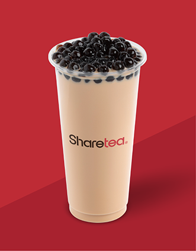

# Sharetea drink images

39 original drink product images from all six categories linked from
https://www.1992sharetea.com/drinks-menu, downloaded September 25, 2026.

| Category | Images |
| --- | ---: |
| Brewed Tea | 2 |
| Milk Tea | 10 |
| Fruit Tea | 6 |
| Non-Caffeinated | 8 |
| Ice Blended | 8 |
| Matcha Series | 5 |
| Total | 39 |

All PNG files are in images/. Filenames use the displayed drink names.
Images are unmodified originals. Source: Sharetea, www.1992sharetea.com.
The image-sources.json file maps each filename to its drink, category, source
page, source image URL, dimensions, and SHA-256 checksum.

The website uses a single picture for some drinks with black/green/oolong
variations. These are saved once, as on the menu. Logos, category banners,
QR codes, topping-only pictures, and promotional graphics are excluded.

## Add to your GitHub project

Copy images/ into your local repository. If images/ already exists, copy the
PNGs into that folder. The two images from the earlier download are included.

From the repository folder:

```sh
git add images
git commit -m "Add Sharetea drink images"
git push
```

In HTML located in the repository root:

```html

```

## Run the scraper again

Place scrape_images.py in your project root, then run:

```sh
python scrape_images.py
```

Windows also supports `py scrape_images.py` when the Python launcher is installed.
No pip packages are needed. The script visits all six category pages and
downloads their product images into images/ beside the script. It uses four
concurrent requests and retries temporary network errors.

The mappings were verified against the visible product names. Several image
alt attributes on the website are wrong or empty, so the script does not use
those attributes to name files. If a category's image list changes, the script
stops and reports the changes so its product mapping can be updated.
